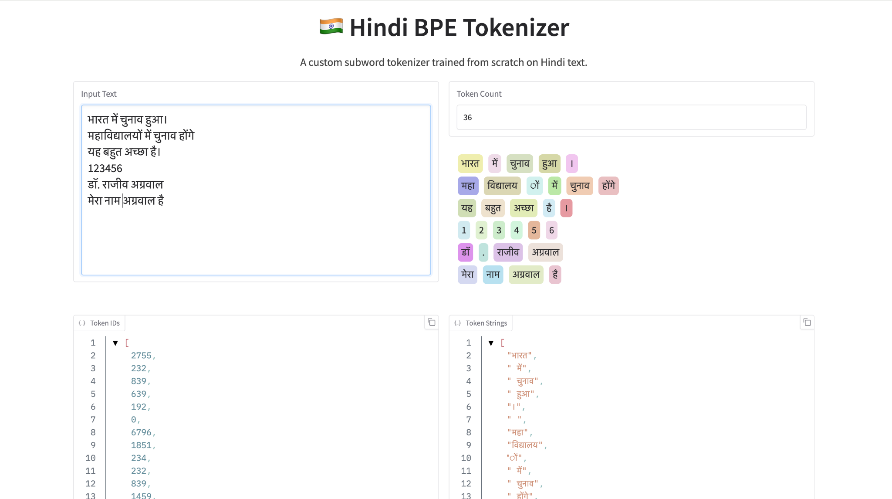

# Tokenizers using Byte Pair Encoding Algorithim




## Project Title: Hindi BPE Tokenizer

### Description
This project implements a custom Byte Pair Encoding (BPE) tokenizer specifically tailored for the Hindi language. It features a robust pre-tokenization strategy to handle Devanagari script nuances and provides an interactive web interface for visualizing how text is split into tokens.

### Key Features
*   **Hindi-Specific Pre-tokenization:** Uses specialized regex patterns (`bpe.py`) to correctly group Devanagari characters, combining marks, and numerals before applying BPE.
*   **Custom BPE Implementation:** A pure Python implementation of the BPE algorithm, including training (merges) and inference (encoding/decoding).
*   **Interactive Visualization:** A Gradio-based web app (`app.py`) that color-codes tokens to visually demonstrate the tokenizer's performance on arbitrary input text.
*   **Model Persistence:** The tokenizer can be saved to and loaded from a pickle file (`hindi_tokenizer.pkl`), preserving the vocabulary and merge rules.

### File Structure
*   `app.py`: The entry point for the web application. It sets up the Gradio interface, handles user input, and renders the color-coded token output.
*   `bpe.py`: The core logic file containing the `HindiBPETokenizer` class. It handles:
    *   Loading the pre-trained model.
    *   Pre-tokenization using regex.
    *   Applying BPE merges to encode text.
    *   Decoding token IDs back to strings.
*   `hindi_tokenizer.pkl`: The serialized file containing the trained tokenizer's vocabulary (`id2sym`, `sym2id`) and merge rules.

### How to Run
1.  Ensure you have the necessary dependencies installed (e.g., `gradio`, `regex`).
2.  Run the application:
    ```bash
    python app.py
    ```
3.  Open the provided local URL in your browser to interact with the tokenizer.


